# **P01 Memòria Tècnica De La Proposta**

# 1. Introducció


Aquesta memòria tècnica presenta la nostra proposta completa per modernitzar els sistemes informàtics de FoodLogistic S.A. Aquesta és una empresa molt coneguda de distribució i logística d'aliments que té la seu a Mataró. Com que darrerament han obert noves rutes i han contractat més personal, la quantitat de dades i les necessitats de comunicació que tenen han crescut moltíssim. 

El problema principal que tenen ara mateix és que la infraestructura informàtica se'ls ha quedat petita. Això fa que tinguin problemes de seguretat i corrin el risc que el negoci s'hagi d'aturar de cop. Per donar-los una solució, hem dissenyat un pla d'acció que es divideix en quatre parts molt clares:

* Infraestructura i Alta Disponibilitat: Com que no es poden permetre aturar el magatzem, muntarem servidors de fitxers i d'impressió preparats perquè mai deixin de funcionar i puguin imprimir etiquetes i albarans sense interrupcions.
* Comunicació al Núvol: El servidor de correu intern que fan servir ara falla molt. El que farem serà moure-ho tot a una plataforma al núvol moderna, segura i que a més els donarà eines per treballar millor en equip.
* Seguretat i Compliment de la LOPD: Amb tanta gent nova a la plantilla, els preocupa el tractament de les dades personals. Crearem vídeos de formació molt pràctics per ensenyar als treballadors com han de tractar les dades de manera segura en el seu dia a dia per complir la llei.
* Presència a Internet: La web que tenen ara és molt antiga i no compleix les normatives de privacitat actuals. Dissenyarem una pàgina web corporativa nova, moderna i completament legal per donar una bona imatge a internet.

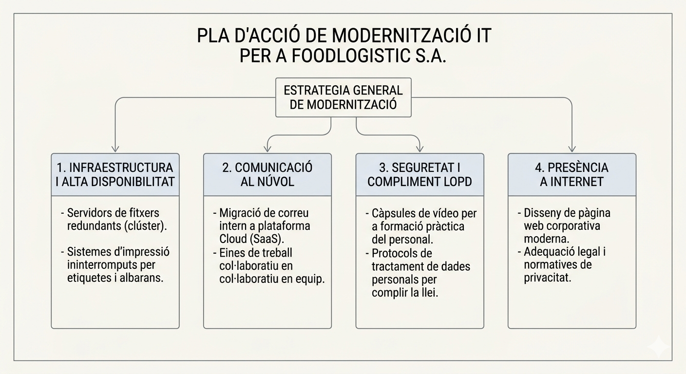

# 2. Anàlisi de necessitats

Després d'estudiar el cas de FoodLogistic S.A. i veure com treballen, ens hem adonat que el seu creixement recent els està passant factura. Han obert noves rutes i han contractat més plantilla, però la informàtica no ha crescut al mateix ritme. Si no fem res, corren el risc de patir aturades greus en la logística i de rebre multes per incomplir la llei. 

Per solucionar això de soca-rel, hem dividit les seves necessitats en aquests quatre blocs principals:

* Infraestructura i Alta Disponibilitat al magatzem: La prioritat de l'empresa és que els camions puguin sortir a l'hora i no es trenqui mai la cadena de fred. Actualment la informació està desordenada i cada departament guarda les coses on vol. Ens demanen un servidor de fitxers centralitzat i segur, amb límits d'espai per evitar que els treballadors guardin coses personals. A més, necessiten un servidor d'impressió preparat perquè, si una impressora s'encalla traient albarans o etiquetes, l'altra agafi la feina automàticament sense aturar la producció.

* Modernització del correu i treball al núvol: El correu electrònic que tenen ara mateix funciona amb un hosting extern que s'ha quedat molt antic, falla sovint i té problemes de seguretat. Necessiten urgentment passar a un entorn de treball modern al núvol. No només volen un correu que funcioni bé, sinó que necessiten eines col·laboratives per a tota la plantilla, com calendaris compartits, opcions per fer videotrucades i molt més d'espai per treballar en equip de manera més eficient.

* Formació i compliment de la llei de protecció de dades: Amb tanta gent nova a l'empresa, la direcció té por de patir alguna fuita de dades de clients o treballadors i rebre una multa de l'Agència Espanyola de Protecció de Dades. Ens han demanat eines formatives molt pràctiques, com per exemple vídeos, per ensenyar les bones pràctiques del dia a dia a tota la plantilla. Necessiten que tothom sàpiga com bloquejar la pantalla de l'ordinador, els perills de fer servir pendrives propis, i com s'han de destruir els documents importants o els currículums.

* Web corporativa i adequació legal: La presència que tenen a internet ara mateix és molt vella i, el que és pitjor, no compleix la normativa actual. La seva pàgina web necessita una actualització urgent per adaptar-se a les lleis de protecció de dades i de serveis d'internet. Ens demanen dissenyar una web nova que doni una imatge professional i que incorpori tots els elements legals obligatoris, com el banner de galetes, la política de privacitat, l'avís legal i formularis de contacte amb les caselles de consentiment corresponents.

| Àrea de millora | Problema actual | Solució necessària |
| :--- | :--- | :--- |
| **Infraestructura i Disponibilitat** | Descentralització de la informació i risc d'aturada logística per fallada en la impressió d'albarans. | Servidor de fitxers centralitzat amb quotes de disc i sistema d'impressió amb redundància automàtica. |
| **Comunicació i Núvol** | Hosting de correu obsolet, inestable i sense eines per al treball col·laboratiu. | Migració a entorn Cloud (SaaS) per a gestió de correu, calendaris compartits i videoconferències. |
| **Seguretat i LOPD** | Risc de fugues de dades i sancions de l'AEPD per desconeixement de la nova plantilla. | Implementació de càpsules formatives en vídeo sobre gestió documental i ciberseguretat bàsica. |
| **Presència Digital i Legal** | Web institucional antiga que incompleix la normativa LSSI-CE i el tractament de galetes. | Desenvolupament de nou portal corporatiu amb adequació legal completa i formularis de consentiment. |


# 3. Proposta de solució

## 3.1 Infraestructura i Alta Disponibilitat

Per començar, hem organitzat l'Active Directory sota el domini foodlogistic.test. Hem creat una unitat organitzativa principal anomenada FoodLogistic_OU i a dins l'hem dividit en tres: Administració, Transport i Direcció. Dins d'aquestes unitats hem creat els grups de seguretat G_Administracio, G_Transport i G_Direccio. 

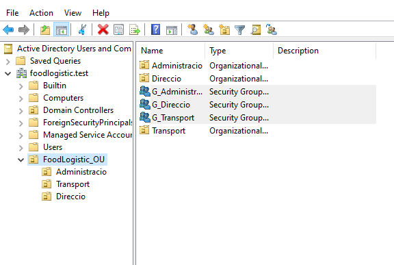

Pel que fa al servidor de fitxers, per organitzar la informació hem creat tres recursos compartits amb nivells de seguretat diferents:

* Carpeta Public: Està a la ruta C:\Public i tothom hi té accés. Hem posat permisos de lectura per compartir i de modificació a nivell NTFS. Per controlar l'espai, li hem posat una quota estricta de 200 MB amb l'eina FSRM. Quan arriben al 90 per cent de l'espai, el sistema els envia aquest avís exacte: Compte! FoodLogistic t'informa que estàs a punt d'esgotar l'espai compartit.
* Carpeta Operacions: Està a C:\Operacions i només hi pot entrar el grup G_Transport amb control total. Hem activat l'enumeració basada en l'accés perquè els altres usuaris ni tan sols la vegin. A més, hem aplicat un filtre que prohibeix guardar fitxers executables com .exe o .msi, i també arxius d'àudio o vídeo.
* Carpeta Direcció: És un recurs ocult exclusiu per al grup G_Direccio. Hem configurat una directiva GPO anomenada Muntatge_Z_Direccio perquè aquesta carpeta s'afegeixi automàticament com a unitat Z: als ordinadors dels caps.

Com a mesura de seguretat extra per a tot el servidor, hem activat les quotes NTFS al volum principal amb un límit de 500 MB per a qualsevol usuari nou, amb un avís quan arribin als 450 MB.

Per a la part d'impressió d'alta disponibilitat del magatzem, hem creat dues instàncies d'impressora anomenades IMP_MAGATZEM_A i IMP_MAGATZEM_B. A la primera li hem activat la funció de printer pooling i hi hem afegit el port de la segona impressora. Així les dues treballen com si fossin una de sola i es reparteixen la feina.

Per evitar que els mossos hagin d'instal·lar res a mà, hem creat una directiva anomenada GPO_Impressores_Magatzem que desplega la impressora tota sola als seus ordinadors. Finalment, per seguretat, hem configurat les hores disponibles perquè només puguin imprimir documents entre les 06:00 i les 22:00.

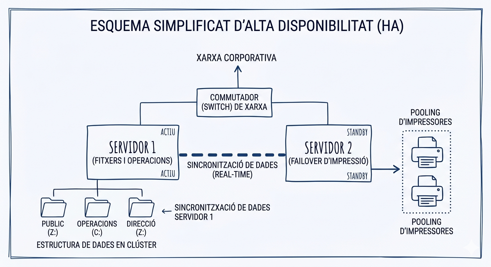


## 3.2 Serveis al núvol

Per solucionar els problemes de seguretat i les limitacions del hosting antic, passarem els 35 treballadors de l'empresa a un entorn de treball col·laboratiu. Hem analitzat diverses opcions com Microsoft 365 Basic, Google Workspace Starter, Zoho Workplace Standard i Lark Suite.

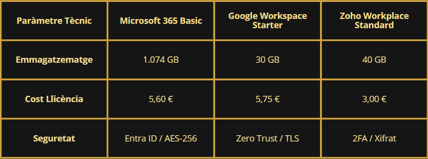

La solució que implementarem és Microsoft 365 Business Basic. El motiu és matemàtic: per 5,60 euros al mes per usuari ens ofereix 1074 GB d'espai en total. Vam descartar Google Workspace perquè ens cobrava més diners, 5,75 euros, per només 30 GB d'espai. També vam descartar Zoho perquè la seva incompatibilitat de formats trenca les macros d'Excel, que són diàries i vitals per a la logística de l'empresa.

A nivell de seguretat, la solució de Microsoft blinda l'empresa amb la gestió d'identitat d'Entra ID i xifratge AES-256 per protegir les dades. A més, configurarem els protocols SPF, DKIM i DMARC al domini per evitar qualsevol intent de suplantació d'identitat amb els correus.

Per fer el pas del correu antic al nou, utilitzarem el Servei de Migració d'Exchange, anomenat EAC, a través del protocol IMAP. Això ens permetrà sincronitzar-ho tot en segon pla sense aturar la feina de l'empresa. L'únic detall que haurem de fer de forma manual és importar els calendaris i contactes locals de cada usuari.

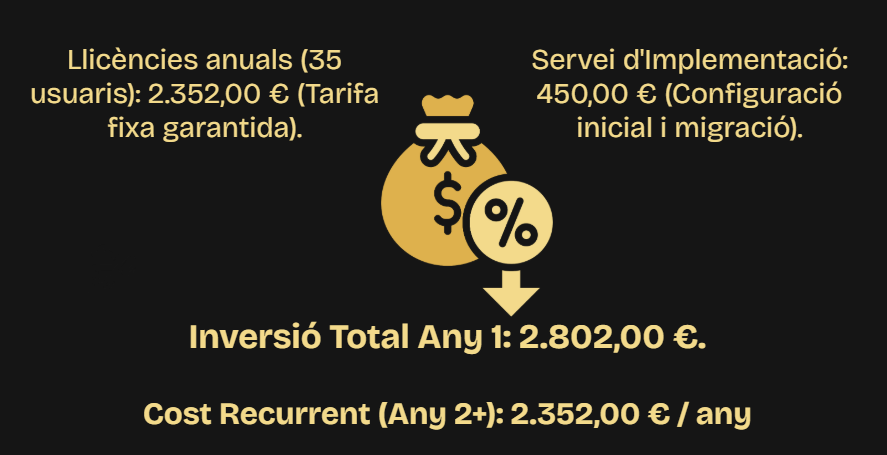

## 3.3 Seguretat i Compliment de la LOPD

Per resoldre les pors de l'empresa sobre la gestió de dades personals, hem preparat una campanya interna de sensibilització que es diu Dades Segures, Logística Eficient. Concretament, hem creat dos videotutorials formatius d'entre 5 i 6 minuts cadascun, basant-nos en les normes de l'Agència Espanyola de Protecció de Dades i la llei LOPD-GDD 3/2018. 

El primer vídeo es titula Compliment legal en el dia a dia a FoodLogistic i va dirigit a tots els treballadors de l'empresa, tant del magatzem com de les oficines i transport. En aquest vídeo expliquem conceptes bàsics del dia a dia, com per exemple l'obligació de bloquejar sempre l'ordinador amb les tecles Windows més L i de fer servir contrasenyes segures. També els avisem dels perills de portar pendrives de casa per culpa del programari maliciós, deixant clar que només poden fer servir els que estiguin xifrats pel departament d'informàtica. A més, els ensenyem a no guardar coses de la feina en un Dropbox personal o enviar-les a un Gmail, sinó a les unitats de xarxa compartides de l'empresa com la unitat S o el SharePoint. També els recordem que han de triturar qualsevol paper important en lloc de tirar-lo a la paperera normal i que no han de deixar documents abandonats a la impressora.

[Video1](https://drive.google.com/file/d/1vBe5U2yowGJiexheOv4j6LR1lq7HGXYY/view?usp=sharing)

El segon vídeo es titula Protecció de dades a RRHH i Gestió i és més tècnic, pensat exclusivament per a l'equip d'administració i recursos humans. Aquí els ensenyem com han de gestionar els currículums, remarcant que els han de destruir en un màxim d'un any si el candidat no és seleccionat. També els expliquem com funciona la cessió de dades a tercers, diferenciant qui és el Responsable del Tractament i qui és l'Encarregat, com per exemple la gestoria que fa les nòmines. Deixem clar que sempre s'ha de tenir un contracte signat segons l'article 28 del RGPD abans d'enviar fitxers. Finalment, incidim en l'obligació de mantenir la confidencialitat segons l'article 5 del RGPD i com han de tramitar de forma molt ràpida les peticions dels drets ARSULIPO, recordant-los que les han de derivar en menys de 24 hores perquè la llei ens dóna només un mes per respondre.

[Video2](https://drive.google.com/file/d/14oRh1KTWVxs_J4lFmYw7j6mP17lGF23r/view)

## 3.4 Presència a Internet i adequació legal

Per solucionar el problema de la web antiga i fer que compleixi la llei LOPDGDD i la LSSI-CE, hem dissenyat i publicat una landing page nova. Com vam fer a la tasca 8, ens vam reunir tot l'equip per debatre i consensuar la millor versió de la web corporativa per presentar-la al client com a solució definitiva.

La nova web està allotjada a Github Pages perquè sigui totalment operativa i accessible sempre. Tècnicament, hem configurat el repositori perquè llegeixi el codi directament des de la carpeta docs treballant sobre la branca main. Per al disseny hem fet servir HTML5, CSS3 i JavaScript, mantenint la coherència visual amb les fonts corporatives Sora i DM Serif Display. 

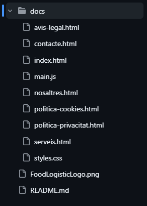

A més, per tenir analítica i control del tràfic sense molestar a l'usuari, hem integrat StatCounter, que fa de comptador invisible. A les proves de funcionament ja vam poder registrar dades, detectant que les visites es feien des de Google Chrome i que la pàgina d'entrada principal era serveis.html.

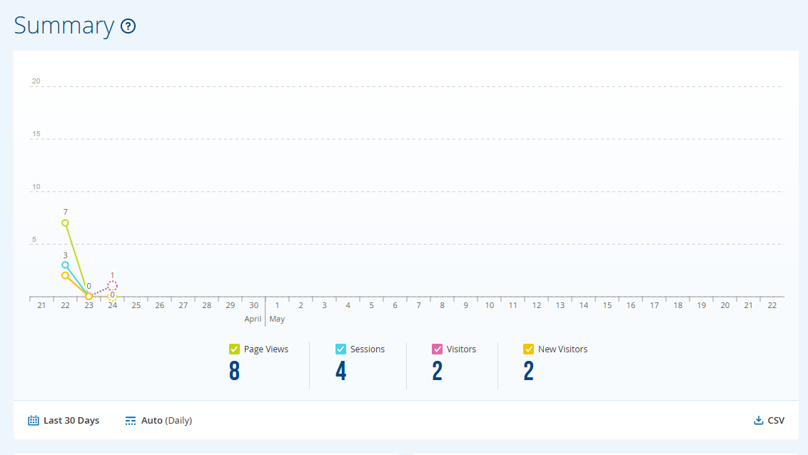

La part més crítica ha estat el que vam anomenar Operació Escut Digital a la tasca 6. Ens hem assegurat que la web sigui cent per cent legal redactant, amb el suport de la intel·ligència artificial Claude, tots els textos obligatoris: l'Avís Legal, la Política de Privacitat i la Política de Cookies. També hem implementat el corresponent banner de cookies programat en JavaScript que informa el visitant només entrar.

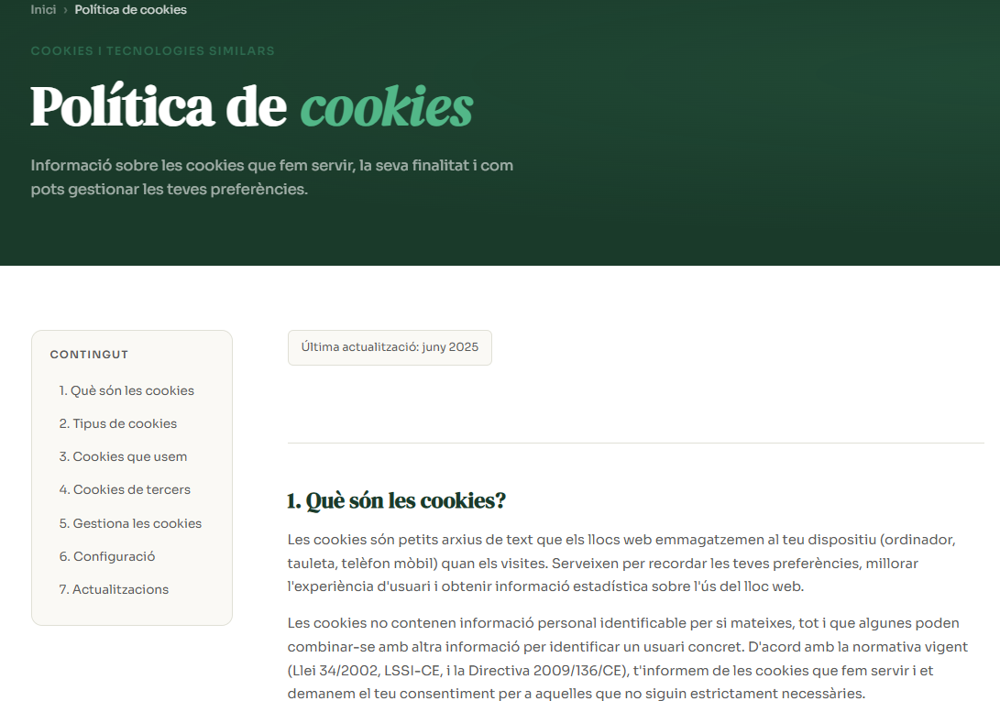

Finalment hem blindat el formulari de contacte, on recollim nom, correu, telèfon i missatge. Hi hem afegit una casella obligatòria i desmarcada per defecte per donar el consentiment a la política de privacitat, i una altra casella opcional per a l'enviament de publicitat. Just a sota hi hem posat la clàusula informativa bàsica per garantir una transparència total.

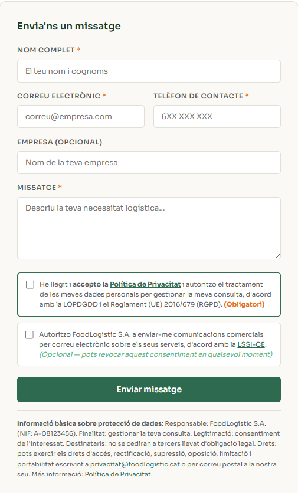

### [Web FoodLogistic](https://classessmx2n.github.io/web-projecte7-AlbertTeruel/)

# 4. Arquitectura i disseny tècnic

A més de la pàgina web pública, per a FoodLogistic S.A. hem dissenyat l'arquitectura d'una plataforma web interna o intranet. L'objectiu és que tots els treballadors tinguin un portal únic on accedir a tota la informació i fer la seva feina diària de manera centralitzada.

La solució proposada per a aquesta intranet està construïda sobre WordPress. Encara que sembli una eina pensada només per fer pàgines web tradicionals, l'hem transformat en un espai de treball privat fent servir diversos connectors (plugins) per afegir-hi tots els serveis necessaris. L'arquitectura tècnica d'aquest portal es divideix en aquestes peces clau:

* Portal d'accés segur: Hem creat un sistema on cada treballador s'identifica amb el seu perfil per accedir a la intranet. Així evitem que persones externes puguin veure la informació corporativa.
* Gestor d'arxius intern: Hem integrat un connector que permet a tots els departaments pujar i compartir documents interns de manera molt fàcil amb la resta de companys.
* Edició de documents en línia: Hem afegit una extensió perquè la plantilla pugui treballar amb documents online directament des del navegador web, sense haver de descarregar res ni tenir programes extra instal·lats.
* Correu, calendaris i tasques: Dins de la mateixa intranet hem configurat mòduls per poder gestionar el correu electrònic de l'empresa, organitzar els calendaris conjunts i repartir i seguir les tasques logístiques de cada empleat.

Tota aquesta estructura web està muntada per funcionar de manera fluida i donar a l'empresa un entorn de treball col·laboratiu completament fet a mida.

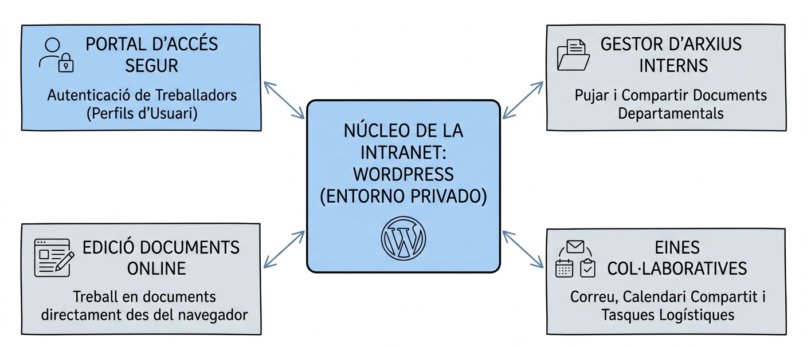

# 5. Pressupost

Per ser el més transparents possible amb el client, hem dividit la nostra proposta econòmica en dues parts clares: el que costa muntar-ho tot d'inici i el que costarà mantenir-ho mes a mes perquè no hagin de patir per res.

Costos d'implantació:
Hem fixat el nostre preu de mà d'obra en 45 euros l'hora, que és la mitjana que cobren els tècnics de sistemes i cloud a Espanya segons el que vam investigar a xarxes com LinkedIn. En total, calculem que dedicarem 47 hores de feina repartides així:
* 16 hores per muntar els servidors d'alta disponibilitat, que són 720 euros.
* 8 hores per configurar la gestió del servidor d'impressió, que són 360 euros.
* 15 hores per guionar i editar els vídeos formatius de la LOPD, que pugen a 675 euros.
* 8 hores per fer tota la migració dels correus antics cap al núvol, que sumen 360 euros.

Això fa un total de 2.115 euros nets. Com que les llicències inicials ja les incloem, si hi sumem el 21 per cent d'IVA, el cost d'arrencada de tot el projecte els queda en 2.559,15 euros.

#### Taula 1: Desglossament de Costos d'Implantació
| Concepte | Hores | Preu/Hora | Subtotal (Net) |
| :--- | :---: | :---: | :---: |
| Servidors d'alta disponibilitat | 16 h | 45 € | 720 € |
| Gestió servidor d'impressió | 8 h | 45 € | 360 € |
| Guió i edició vídeos formatius LOPD | 15 h | 45 € | 675 € |
| Migració de correu cap al núvol | 8 h | 45 € | 360 € |
| **Total hores i base imposable** | **47 h** | - | **2.115 €** |
| **TOTAL PROJECTE (IVA 21% Inclòs)** | - | - | **2.559,15 €** |

Costos recurrents i manteniment:
Aquesta és la quota fixa que l'empresa haurà de pagar cada mes per tenir els sistemes modernitzats i funcionant sense cap ensurt:
* Llicències de la plataforma Microsoft 365 per als seus 35 usuaris, que surten a 196 euros al mes.
* Allotjament de la pàgina web amb l'empresa Raiola Networks, que hem triat perquè tenen molt bon suport tècnic nacional, ens costa 8,95 euros al mes, i només cal afegir 6,90 euros un cop l'any pel domini .es.
* El nostre servei de manteniment i suport tècnic costa 150 euros al mes. Aquí els donem tranquil·litat total perquè ens encarreguem de fer les còpies de seguretat, actualitzar la web i resoldre qualsevol incidència.

Totes aquestes despeses sumen 354,95 euros mensuals. Si hi apliquem l'IVA corresponent, la quota total que pagaran cada mes serà de 429,49 euros.

#### Taula 2: Costos Recurrents i Manteniment
| Concepte | Freqüència | Cost (Net) |
| :--- | :--- | :---: |
| Llicències Microsoft 365 (35 usuaris) | Mensual | 196,00 € |
| Allotjament Web (Raiola Networks) | Mensual | 8,95 € |
| Manteniment i suport tècnic | Mensual | 150,00 € |
| Domini .es | Anual | 6,90 € |
| **Subtotal Mensual (Base imposable)** | **Mensual** | **354,95 €** |
| **QUOTA TOTAL MENSUAL (IVA 21% Inclòs)** | **Mensual** | **429,49 €** |

# 6. Planificació del projecte

Per demostrar a la direcció de FoodLogistic que som un equip professional, hem dissenyat un pla de treball per tenir tota la modernització llesta en un termini de 15 dies hàbils. Hem organitzat les tasques amb cap perquè tot vagi rodat i no hi hagi temps morts.

Ordre de les tasques i treball en paral·lel:
* El primer de tot ha estat tancar la fase d'anàlisi i definir l'estructura de l'empresa. Sense això completat, era impossible començar a muntar l'Active Directory als servidors.
* El cor del projecte és tota la configuració dels servidors i de les carpetes compartides. Aquesta tasca és el nostre coll d'ampolla principal, ja que si això no està acabat, no podem configurar l'alta disponibilitat de les impressores del magatzem ni tancar la documentació.
* Mentre els servidors es configuraven, la resta de l'equip no s'ha quedat de braços creuats. Hem avançat en paral·lel amb el disseny de la identitat digital a la web i l'estudi de mercat del correu al núvol per optimitzar al màxim el nostre calendari.

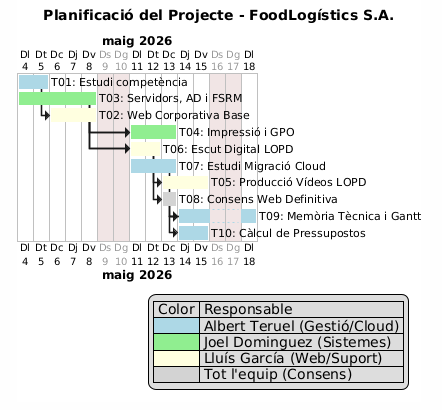

Codi UML
```text
@startgantt
title Planificació del Projecte - FoodLogístics S.A.
language ca
Project starts 2026-05-04
saturday are closed
sunday are closed

' --- Estils ---
skinparam {
ganttChartTitleFontSize 20
taskFontSize 14
taskHeight 30
}

' --- SETMANA 1 (4 a 8 de maig) ---
[T01: Estudi competència] as [T01] lasts 2 days
[T03: Servidors, AD i FSRM] as [T03] lasts 5 days
[T02: Web Corporativa Base] as [T02] lasts 3 days
[T01] starts at 2026-05-04
[T03] starts at 2026-05-04
[T02] starts at [T01]'s end

' --- SETMANA 2 (11 a 15 de maig) ---
[T04: Impressió i GPO] as [T04] lasts 3 days
[T06: Escut Digital LOPD] as [T06] lasts 2 days
[T07: Estudi Migració Cloud] as [T07] lasts 3 days
[T05: Producció Vídeos LOPD] as [T05] lasts 3 days
[T04] starts at [T03]'s end
[T06] starts at [T02]'s end
[T07] starts at 2026-05-11
[T05] starts at [T06]'s end

' --- SETMANA 3 (18 a 22 de maig) ---
[T08: Consens Web Definitiva] as [T08] lasts 1 day
[T09: Memòria Tècnica i Gantt] as [T09] lasts 3 days
[T10: Càlcul de Pressupostos] as [T10] lasts 2 days
[T08] starts at [T06]'s end
[T09] starts at [T07]'s end
[T10] starts at [T09]'s start

' --- Dependències Forçades (Fletxes) ---
[T03] -> [T04]
[T02] -> [T06]
[T08] -> [T09]

' --- Colors per Responsable (RACI) ---
[T01] is colored in LightBlue
[T07] is colored in LightBlue
[T09] is colored in LightBlue
[T10] is colored in LightBlue
[T03] is colored in LightGreen
[T04] is colored in LightGreen
[T02] is colored in LightYellow
[T05] is colored in LightYellow
[T06] is colored in LightYellow
[T08] is colored in LightGray

legend right
| Color | Responsable |
| <#LightBlue> | Albert Teruel (Gestió/Cloud) |
| <#LightGreen> | Joel Dominguez (Sistemes) |
| <#LightYellow> | Lluís García (Web/Suport) |
| <#LightGray> | Tot l'equip (Consens) |
end legend
@endgantt
```

Repartiment de la feina:
Ens hem dividit les responsabilitats per ser més eficients i aprofitar els punts forts de cadascú. En Joel s'ha encarregat de liderar la part dura de sistemes i del servidor d'impressió. El Lluís ha pres la responsabilitat de gestionar tota la part visual i de guions per als vídeos formatius de la LOPD. I finalment, l'Albert ha capitanejat la tria dels proveïdors per al núvol i s'ha encarregat de la part legal de la web i de buscar els consensos. 

| Tasca | Albert | Joel | Lluís |
| :-- | :-- | :-- | :-- |
| T01 (Competència) | R/A | I | C |
| T03 (Sistemes) | C | R/A | I |
| T04 (Impressió) | I | R/A | C |
| T05 (Vídeos LOPD) | C | I | R/A |
| T07 (Cloud) | R/A | C | I |
| T08 (Consens) | A | R | R |

Pla de contingència i riscos:
Com que en informàtica sempre hi pot haver imprevistos, hem preparat un pla de contingència per als riscos més evidents:
* Si la configuració dels servidors s'allarga massa, aplicarem immediatament els 2 dies de marge que hem guardat al final del calendari i donarem prioritat a què funcionin les quotes d'espai abans que el filtre d'arxius.
* Per evitar pantalles blaves o problemes a l'hora de desplegar les impressores als ordinadors de forma automàtica, farem còpies de seguretat exactes o snapshots abans de tocar cap directiva de grup.
* Si a l'hora de la veritat el pressupost de les llicències de Microsoft superés el límit acordat, tenim llest el pla B per passar tota l'empresa a Google Workspace sense perdre temps.

| Risc | Impacte | Mesura de resposta |
| :-- | :-- | :-- |
| Retard en T03 (AD/NTFS) | Alt | Aplicació immediata dels 2 dies de buffer final i priorització de les quotes NTFS sobre el filtratge de fitxers. |
| Incompatibilitat GPO (T04) | Mitjà | Ús de punts de restauració (snapshots) abans del desplegament de les polítiques d'impressió. |
| Error en Pressupost Cloud (T07) | Baix | Activació del Pla B (Google Workspace) si les llicències M365 superen el límit de cost per usuari. |

# 7. Conclusions finals

Per tancar aquesta memòria tècnica, podem assegurar a la direcció de FoodLogistic S.A. que la proposta que presentem resol de soca-rel tots els problemes que ens van plantejar a causa del seu creixement recent. Hem dissenyat una infraestructura on els camions no s'aturaran mai per culpa d'una impressora o un servidor caigut, on els treballadors tindran més de mil gigues d'espai i eines col·laboratives al núvol, i on la privacitat de les dades estarà assegurada i complirà fil per randa amb la llei vigent, tant a les oficines com a la seva web.

A més a més, el gran valor afegit de la nostra empresa no és només la tecnologia que instal·lem, sinó el servei que donem. Com a empresa de serveis informàtics amb seu a Mataró, oferim un suport tècnic de quilòmetre zero. Al contrari que altres empreses de la competència més grans que poden trigar hores a respondre o enviar un tècnic, nosaltres garantim que podem plantar-nos a la nau del Polígon de les Hortes en menys de 15 minuts si hi ha qualsevol aturada crítica.

Amb el nostre pressupost transparent, una planificació realista de 15 dies hàbils i el nostre equip tècnic dedicat, estem totalment preparats per modernitzar la informàtica de FoodLogistic i donar-los la tranquil·litat que necessiten per seguir creixent.
