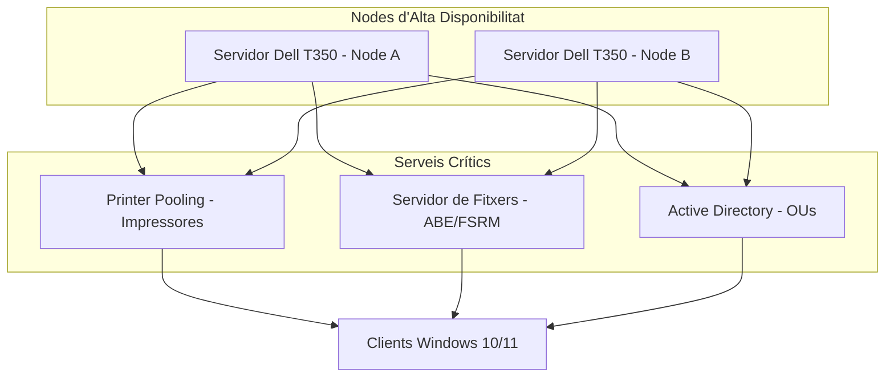
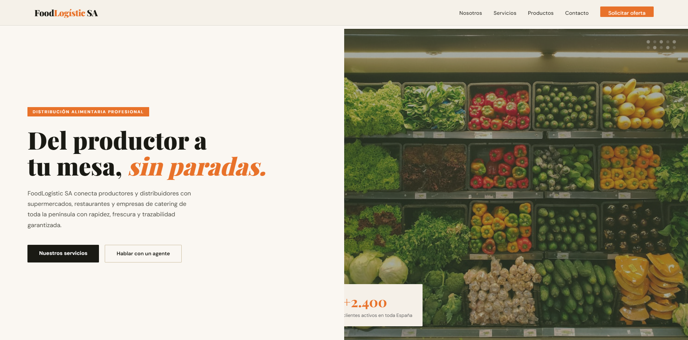
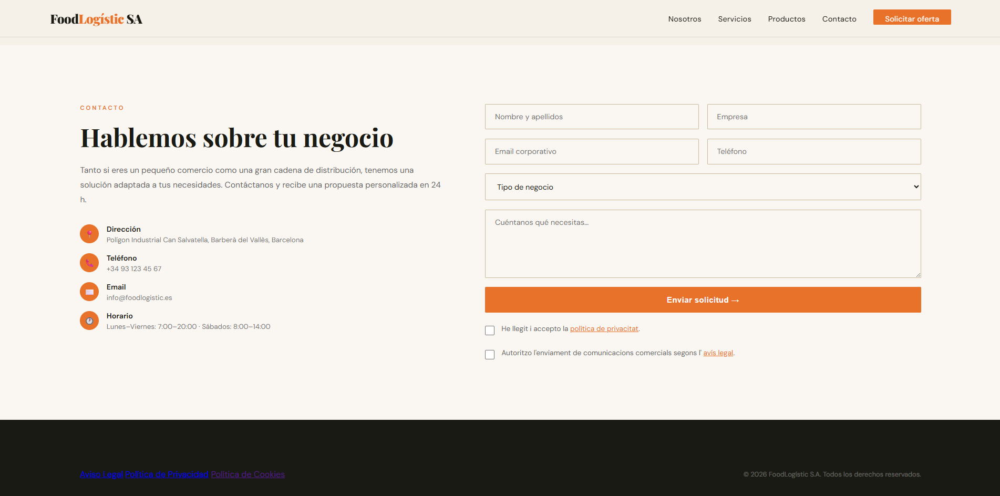
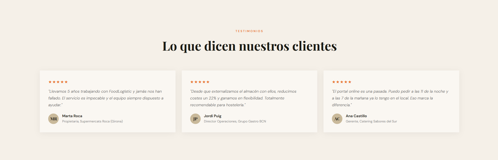
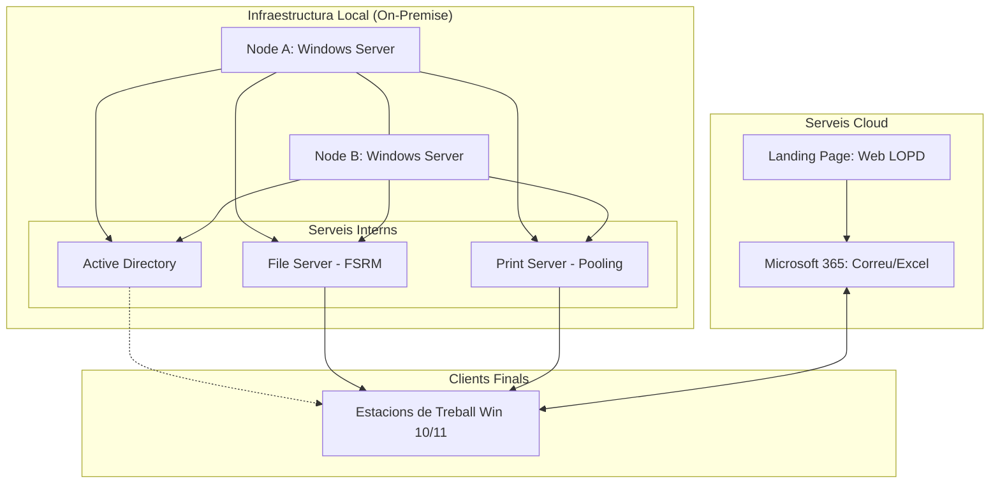
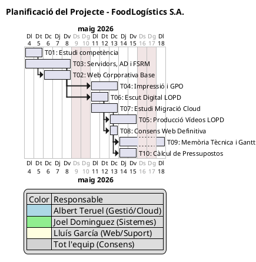

# Memòria del Projecte: Renovació Tecnològica FoodLogístics S.A.

## 1. Introducció

Aquest projecte s'ha desenvolupat per respondre a les necessitats de **FoodLogístics S.A.**, una empresa de logística ubicada al Maresme que requereix una renovació integral de la seva infraestructura informàtica per adaptar-se als estàndards actuals i al marc legal vigent. 

### Contextualització
En l'entorn empresarial actual, disposar de sistemes operatius eficients i segurs és fonamental per garantir la continuïtat del negoci. Després d'una auditoria dels sistemes actuals, s'han detectat les següents mancances crítiques:

* **Obsolescència tecnològica:** Infraestructura de maquinari i programari desactualitzada.
* **Inestabilitat del servei:** Fallades recurrents en el sistema de correu electrònic.
* **Manca de redundància:** Absència de sistemes de seguretat o alta disponibilitat en els servidors, cosa que posa en risc la generació d'albarans i etiquetatge, podent aturar tota la cadena logística.
* **Incompliment legal:** La pàgina web actual no compleix amb la **Llei Orgànica de Protecció de Dades (LOPD)**.

### Objectius del Projecte
L'objectiu principal d'aquest treball és la implementació d'una infraestructura robusta i moderna basada en:

1.  **Alta Disponibilitat:** Desplegament d'una xarxa nova amb servidors de fitxers i d'impressió redundants.
2.  **Migració al Núvol:** Trasllat del servei de correu electrònic a una plataforma cloud.
3.  **Adequació Normativa:** Correcció de la part legal i tècnica de la presència web.
4.  **Gestió Centralitzada:** Configuració de polítiques de grup (GPO) per al control de la xarxa.

Amb aquesta intervenció, es pretén dotar FoodLogístics S.A. d'un sistema informàtic ràpid, segur i escalable per al futur.

---

## 2. Anàlisi de necessitats

A partir de l'auditoria realitzada a **FoodLogístic S.A.**, s'ha determinat que la infraestructura actual presenta un alt grau d'obsolescència i inseguretat, factors crítics tenint en compte el seu volum de negoci actual. 

A continuació, es detallen els problemes detectats i les propostes de millora tècnica.

### 2.1. Matriu de Relació Problema-Solució

| Problema | Impacte | Solució Proposada |
| :--- | :--- | :--- |
| **Infraestructura obsoleta** | Risc de pèrdua de dades i aturades constants del sistema. | Instal·lació de servidors nous en **Alta Disponibilitat (HA)**. |
| **Hosting de correu inestable** | Talls en la comunicació i pèrdua de correus electrònics. | Migració de 35 bústies a **Microsoft 365 (Cloud)**. |
| **Falta de seguretat legal** | Possibles sancions de l'AEPD per incompliment de la LOPD-GDD. | Adequació legal de la web (avisos, privacitat i gestió de cookies). |
| **Punts únics de fallada (SPOF)** | Aturada de la logística si falla la impressora de magatzem. | Configuració de **Printer Pooling** per a impressores redundants. |
| **Desordre en els fitxers** | Falta de control d'espai i ús indegut per a fitxers personals. | Implementació de **FSRM** amb quotes de disc i filtres de fitxers. |

### 2.2. Necessitats del client

L'estratègia de renovació s'ha dissenyat sota un horitzó de **10 anys**, centrant-se en tres eixos fonamentals:

* **Tranquil·litat operativa:** Garantir que el sistema d'emissió d'albarans romangui actiu sense interrupcions.
* **Seguretat de la informació:** Protecció integral de les dades de treballadors i clients davant filtracions.
* **Escalabilitat:** Capacitat de creixement orgànic (personal i dades) sense requerir canvis estructurals.

### 2.3. Requisits tècnics

Per donar compliment als objectius fixats, la nova infraestructura ha d'integrar:

#### Gestió d'Identitat i Accessos
* **Active Directory:** Domini organitzat mitjançant Unitats Organitzatives (UO) jeràrquiques.
* **Access-Based Enumeration (ABE):** Visibilitat selectiva de directoris segons els permisos de l'usuari.

#### Automatització i Control
* **Polítiques de Grup (GPO):** Mapeig automàtic d'unitats de xarxa i impressores.
* **FSRM (File Server Resource Manager):** Gestió de quotes i bloqueig d'extensions de fitxers no permesos.

#### Seguretat i Comunicacions
* **Protecció de correu:** Configuració de protocols **SPF, DKIM i DMARC** per mitigar atacs de *phishing* i assegurar la lliurabilitat.

---

## 3. Proposta de solució

### 3.1 Infraestructura i alta disponibilitat

Per garantir la continuïtat operativa de **FoodLogístic S.A.**, s'ha dissenyat una infraestructura basada en la redundància de maquinari i la gestió centralitzada mitjançant **Active Directory**. El nucli del sistema el constitueixen dos servidors físics configurats per oferir serveis de fitxers i impressió sense interrupcions.

#### Diagrama d'Arquitectura de Serveis

### Taula de components de la infraestructura

| Component | Funció Principal | Justificació Tècnica |
| :--- | :--- | :--- |
| **Dell PowerEdge T350** | Servidors físics | Maquinari professional per a càrregues de treball 24/7. |
| **Windows Server 2022** | Sistema Operatiu de xarxa | Gestió oficial de domini, GPOs i serveis FSRM. |
| **Active Directory** | Gestió d'usuaris i OUs | Organització departamental i delegació de permisos. |
| **Printer Pooling** | Redundància d'impressió | Desviament automàtic de la cua si una impressora falla. |

---

### 3.2 Serveis al núvol

S'ha realitzat una comparativa de les solucions Cloud per substituir el servei de correu actual de l'empresa (35 bústies), prioritzant capacitat i cost.

#### Taula comparativa de solucions Cloud

| Paràmetre | Microsoft 365 Basic | Google Workspace Starter | Zoho Workplace Standard |
| :--- | :--- | :--- | :--- |
| **Emmagatzematge** | **1.074 GB (1 TB)** | 30 GB | 40 GB |
| **Cost mensual/usuari** | 5,60 € | 5,75 € | **3,00 €** |
| **Seguretat** | Entra ID / AES-256 | Zero Trust / TLS | 2FA / Xifrat |

**Justificació de la decisió:**  
S'ha escollit **Microsoft 365 Business Basic** per la seva gran capacitat d'emmagatzematge (36 vegades superior a Google) i la seva compatibilitat total amb les macros d'Excel utilitzades en la logística de l'empresa.

---

### 3.3 Seguretat i LOPD

La seguretat s'articula en tres pilars: protecció de dades al servidor, seguretat de les comunicacions i formació.

#### Mesures de seguretat implementades
* **Higiene del Domini:** Implementació de registres **SPF, DKIM i DMARC** per mitigar el *phishing*.
* **Control d'accés (ABE):** Filtrat de carpetes de xarxa segons permisos d'usuari.
* **Bloqueig de sessió:** Protocol de seguretat física (Windows + L).
* **Xifratge:** Ús de dispositius USB amb xifratge per a dades físiques.

#### Taula resum de seguretat

| Àmbit | Mesura | Objectiu Legal / Tècnic |
| :--- | :--- | :--- |
| **Digital** | Xifratge AES-256 | Protecció de dades en repòs (RGPD). |
| **Físic** | Política de taules netes | Privacitat davant de visites externes. |
| **Xarxa** | Quotes FSRM i filtres | Prevenció de saturació i programari maliciós. |

---

### 3.4 Presència web

La nova presència web es defineix com una *landing page* informativa alineada amb el marc legal vigent.

[URL Pagina Web](https://samalluis.github.io/web-corporativa/#contact)

### Requisits legals integrats

*   **Banner de Cookies:** Implementació d'un sistema de gestió de consentiment actiu que permet a l'usuari acceptar o rebutjar les galetes abans de la navegació.
*   **Checkboxes de Consentiment:** Integració de caselles de verificació desmarcades per defecte en els formularis de contacte, separant l'acceptació de la política de privacitat de la subscripció a comunicacions comercials.
*   **Textos Legals:** Creació de seccions específiques i accessibles per a l'**Avís Legal**, la **Política de Privacitat** i la **Política de Cookies**, detallant el responsable del tractament de les dades i els terminis de conservació.

---

## 4. Arquitectura i disseny tècnic

En aquest apartat es defineix l'ecosistema tecnològic de **FoodLogístics S.A.**, detallant la interconnexió entre els nous sistemes implementats i el flux de treball global de l'organització.

### 4.1. Funcionament global del sistema

La infraestructura s'ha dissenyat sota un model híbrid que combina la robustesa del control local amb la flexibilitat del núvol:

*   **Gestió Local:** Control d'usuaris, fitxers i dispositius mitjançant *Active Directory* i servidors en *Alta Disponibilitat*.
*   **Gestió Cloud:** Comunicacions i correu electrònic centralitzats a *Microsoft 365*.
*   **Capa Web:** Punt d'entrada de clients amb formularis de contacte vinculats a les polítiques de privacitat.

### 4.2. Diagrama d'Arquitectura Global

El següent diagrama representa la relació jeràrquica i el flux de dades entre els diferents components del projecte:

### 4.3. Relació entre sistemes

*   **Sincronització:** Els equips locals s'autentiquen mitjançant el domini local mentre utilitzen de forma integrada les eines de col·laboració en el núvol.
*   **Flux de Dades:** Les dades recollides al formulari de la **Web (LOPD)** es gestionen sota les mesures de seguretat i xifratge de **Microsoft 365**.
*   **Continuïtat:** Els nodes configurats en alta disponibilitat garanteixen que els serveis de **Fitxers (FS)** i **Impressió (PS)** estiguin permanentment disponibles per als clients de la xarxa.

---

## 5. Pressupost

El pressupost s’ha calculat basant-se en un preu mitjà de mercat de **45 €/hora** per a la consultoria i implementació IT. Es divideix en la inversió inicial de posada en marxa i les quotes mensuals de manteniment i serveis.

### 5.1. Cost d'implantació (Inversió Inicial)

Aquest apartat inclou les hores de mà d'obra tècnica necessàries per configurar tota la infraestructura d'alta disponibilitat, el sistema d'impressió, la formació legal i la migració al núvol.

| Concepte | Unitats (Hores) | Preu Unitari | Total (sense IVA) |
| :--- | :---: | :---: | :---: |
| **T03: Servidors d'Alta Disponibilitat** | 16 | 45,00 € | 720,00 € |
| **T04: Gestió d'Impressió** | 8 | 45,00 € | 360,00 € |
| **T05: Elaboració Vídeos LOPD** | 15 | 45,00 € | 675,00 € |
| **T07: Migració al Cloud** | 8 | 45,00 € | 360,00 € |
| **TOTAL MÀ D'OBRA (Base Imposable)** | **47** | | **2.115,00 €** |
| IVA (21%) | | | 444,15 € |
| **TOTAL IMPLANTACIÓ (amb IVA)** | | | **2.559,15 €** |

---

### 5.2. Costos recurrents (Mensualitats)

Són les despeses fixes per mantenir les llicències de programari, l'allotjament de la web i el servei de suport tècnic preventiu.

| Concepte | Periodicitat | Import (sense IVA) |
| :--- | :--- | :---: |
| Subscripció Microsoft 365 (35 usuaris) | Mensual | 196,00 € |
| Manteniment Preventiu i Suport | Mensual | 150,00 € |
| Allotjament Web (Hosting) | Mensual | 8,95 € |
| **TOTAL MENSUAL (Base Imposable)** | | **354,95 €** |
| IVA Mensual (21%) | | 74,54 € |
| **TOTAL QUOTA MENSUAL (amb IVA)** | | **429,49 €** |

> **Nota:** El domini `.es` té un cost addicional de **6,90 €** de pagament anual.

---

### 5.3. Justificació econòmica

*   **Eficiència en la implantació:** S'ha optimitzat el calendari de treball per completar la posada en marxa en **47 hores totals** de servei tècnic.
*   **Model SaaS:** L'ús de *Microsoft 365 Business Basic* permet un cost controlat per usuari (5,60 €/mes) amb una disponibilitat i seguretat garantides pel proveïdor.
*   **Manteniment integral:** La quota de 150 € inclou tasques crítiques com el monitoratge de les còpies de seguretat i l'aplicació d'actualitzacions de seguretat.

---

## 6. Planificació

La planificació del projecte s'ha dissenyat per modernitzar la infraestructura en un termini estricte de **15 dies hàbils (3 setmanes)**, garantint que les tasques crítiques de servidors no bloquegin la resta de l'operativa.

### 6.1. Fases del projecte i temps estimat

L'esforç s'ha calculat basant-se en la complexitat tècnica de cada tasca, incloent-hi la recerca, la implementació real i una fase de proves per evitar errors en producció.

| Tasca | Descripció | Responsable | Temps estimat |
| :--- | :--- | :--- | :--- |
| **T01** | Estudi de la competència i organigrama estratègic. | Albert | 2 dies |
| **T03** | Configuració de servidors, AD, permisos i FSRM. | Joel | 5 dies |
| **T02** | Desenvolupament de la web corporativa base. | Lluís | 3 dies |
| **T04** | Gestió d'impressió en xarxa i desplegament de GPOs. | Joel | 3 dies |
| **T06** | Implementació de l'escut digital (LOPD-GDD) a la web. | Lluís | 2 dies |
| **T07** | Estudi comparatiu i pla de migració al Cloud. | Albert | 3 dies |
| **T05** | Producció de vídeos formatius de seguretat LOPD. | Lluís | 3 dies |
| **T09** | Redacció de la memòria tècnica i documentació. | Albert | 3 dies |

---

### 6.2. Diagrama de Gantt

Aquest diagrama mostra el camí crític del projecte. Es pot observar que la **T03** és el bloquejant principal: sense la configuració dels servidors no es pot procedir a la gestió d'impressió (T04) ni a l'aplicació de polítiques de seguretat.

### 6.3. Anàlisi de riscos i contingència

Per garantir el lliurament del projecte el **22 de maig**, s'han definit les següents mesures davant d'imprevistos:

*   **Risc de retard en servidors (T03):** En cas que la configuració del controlador de domini s'allargui, s'utilitzaran els 2 dies de marge final i es prioritzaran les quotes NTFS per sobre del filtratge de fitxers.
*   **Errors en GPOs (T04):** Es treballarà amb *snapshots* (punts de restauració) abans de cada desplegament per permetre un *rollback* immediat si la configuració d'impressores falla.
*   **Paral·lelisme Operatiu:** Mentre es desenvolupa la infraestructura base, s'avançarà simultàniament en l'escut digital i la recerca Cloud per optimitzar els terminis del calendari.

---

## 7. Conclusions

La implementació d'aquest projecte transforma una infraestructura tecnològica obsoleta i insegura en un entorn professional, robust i preparat per al futur. La solució no només resol els problemes tècnics actuals, sinó que blinda l'operativa logística de l'empresa davant de qualsevol imprevist.

---

### 7.1. Valor de la proposta

El valor principal de la nostra intervenció rau en la **seguretat integral** i la **tranquil·litat operativa**. Hem passat d'un model de "reacció davant l'error" a un model de prevenció activa mitjançant l'alta disponibilitat i els serveis al núvol. 

La combinació de tecnologies punteres (*Microsoft 365*, *Dell HA*) amb una gestió de proximitat garanteix que la tecnologia sigui un motor i no un fre per a **FoodLogístic S.A.**

---

### 7.2. Beneficis per al client

*   **Continuïtat de Negoci Garantida:** Gràcies al *Printer Pooling* i als servidors redundants, el risc d'aturada de la cadena de logística per falta d'albarans és pràcticament zero.
*   **Compliment Legal Absolut:** L'empresa ja compleix totalment amb la **LOPD-GDD** i el **RGPD**, tant a la seva pàgina web com en el tractament intern de dades, evitant sancions econòmiques greus.
*   **Eficiència i Col·laboració:** La migració a *Microsoft 365* permet als 35 usuaris treballar amb eines modernes i un emmagatzematge d'1 TB que elimina les limitacions d'espai històriques.
*   **Control i Orde:** L'estructura d'*Active Directory* i les quotes de disc *FSRM* permeten una administració professional on la informació està organitzada, xifrada i accessible només per al personal autoritzat.
*   **Optimització Econòmica:** S'ha aconseguit una inversió inicial ajustada (**CAPEX**) i una quota mensual (**OPEX**) molt competitiva que inclou suport preventiu i llicenciament actualitzat.

> **Conclusió final:** FoodLogístic S.A. disposa ara d'un **escut digital** que protegeix el seu actiu més valuós: la informació.
